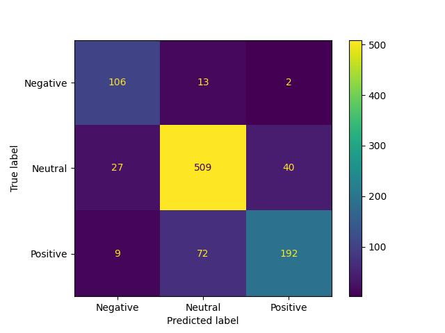

# Financial Sentiment Analysis using DistilBERT

## Project Overview

This project fine-tunes DistilBERT for financial sentiment classification using the Financial PhraseBank dataset.

The goal is to classify financial news statements into:

* Negative
* Neutral
* Positive

The project demonstrates an end-to-end Transformer-based NLP workflow including tokenization, fine-tuning, evaluation, model persistence, and deployment through a Streamlit interface.

---

## Dataset

Dataset: Financial PhraseBank

Total Samples: 4,846

### Labels

| Label | Sentiment |
| ----- | --------- |
| 0     | Negative  |
| 1     | Neutral   |
| 2     | Positive  |

### Class Distribution

| Class    | Samples |
| -------- | ------: |
| Negative |     604 |
| Neutral  |    2879 |
| Positive |    1363 |

---

## Model

### DistilBERT

DistilBERT is a compressed version of BERT created through knowledge distillation.

| Model      | Layers | Parameters |
| ---------- | -----: | ---------: |
| BERT Base  |     12 |       110M |
| DistilBERT |      6 |        66M |

Benefits:

* Smaller model size
* Faster inference
* Lower memory usage
* Retains most of BERT's performance

---

## Training Configuration

| Hyperparameter | Value |
| -------------- | ----- |
| Learning Rate  | 2e-5  |
| Batch Size     | 16    |
| Epochs         | 3     |
| Max Length     | 128   |
| Optimizer      | AdamW |

---

## Training Loss

| Epoch |   Loss |
| ----- | -----: |
| 1     | 0.5815 |
| 2     | 0.2953 |
| 3     | 0.1656 |

---

## Results

### Accuracy

**83.09%**

### Classification Report

| Class    | Precision | Recall | F1 Score |
| -------- | --------: | -----: | -------: |
| Negative |      0.78 |   0.83 |     0.81 |
| Neutral  |      0.91 |   0.82 |     0.86 |
| Positive |      0.72 |   0.85 |     0.78 |

### Overall Metrics

| Metric      | Score |
| ----------- | ----: |
| Accuracy    |  0.83 |
| Macro F1    |  0.82 |
| Weighted F1 |  0.83 |

---
## Confusion Matrix

The confusion matrix provides a detailed view of how the model performs across all sentiment classes.



### Interpretation

Rows represent the actual labels and columns represent the predicted labels.

* Diagonal values indicate correct predictions.
* Off-diagonal values indicate misclassifications.
* Higher values along the diagonal indicate better model performance.

The DistilBERT model correctly classified most samples across all three sentiment classes, achieving strong performance on both majority and minority classes.

### Class-wise Performance

#### Negative

* Precision: 0.78
* Recall: 0.83
* F1 Score: 0.81

The model successfully identified most negative financial statements despite this being the smallest class in the dataset.

#### Neutral

* Precision: 0.91
* Recall: 0.82
* F1 Score: 0.86

Neutral statements achieved the highest F1 score, benefiting from the largest number of training samples.

#### Positive

* Precision: 0.72
* Recall: 0.85
* F1 Score: 0.78

The model captured most positive statements effectively, achieving strong recall while maintaining good precision.

### Key Observation

The confusion matrix demonstrates that DistilBERT learned meaningful contextual representations of financial text and generalized well across all sentiment categories, resulting in an overall accuracy of **83.09%** and a **Macro F1 Score of 0.82**.

## Generated Outputs

* Classification Report
* Confusion Matrix
* Training Loss Curve
* Saved DistilBERT Model

---

## Streamlit Application

The project includes a Streamlit interface for real-time financial sentiment prediction.

Example:

Input:

```text
The company announced record quarterly profits.
```

Output:

```text
Positive
```

---

## Project Structure

```text
financial_sentiment_analysis_transformers/

├── app/
│   └── streamlit_app.py
├── data/
├── reports/
├── saved_model/
├── train.py
├── inference.py
├── requirements.txt
└── README.md
```

---

## Skills Demonstrated

* Transformer Architecture
* DistilBERT Fine-Tuning
* Hugging Face Transformers
* PyTorch
* NLP Classification
* Model Evaluation
* Streamlit Deployment
* Transfer Learning

---

## Previous Work

This project builds upon earlier NLP projects involving:

* TF-IDF + Logistic Regression
* LSTM
* BiLSTM
* BiLSTM + Attention

Those implementations are available in separate repositories and were developed before transitioning to Transformer-based architectures.

---

## Conclusion

DistilBERT achieved 83.09% accuracy and 0.82 Macro F1 on the Financial PhraseBank dataset while providing a lightweight and efficient Transformer solution suitable for real-world NLP applications.
